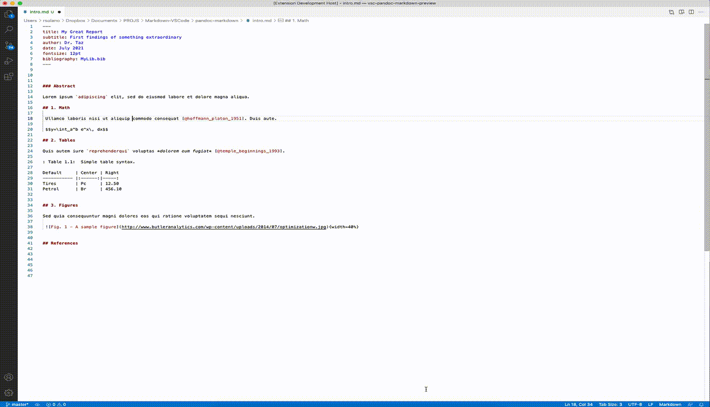

# Pandoc Markdown README

A VS Code extension for writing (with live preview) Markdown documents using [Pandoc].

## Features

* Fully supports all Pandoc extensions (metadata, bibliography, etc.)
* Provides full Pandoc live previewing
* Provides an enhanced *Article* (CSS) style
* Allows user-defined extra Pandoc command line options
* Provides a function to exports to HTML
* Access to local media from rendered preview panel (images, etc.)
* Fully configurable via header YAML metadata

## Requirements

Requieres [Pandoc] available from command line.

## Provides

* `Pandoc Markdown: Open Preview`: ([Ctrl-Shft-R] Win / [Cmd-Shft-R] Mac) Renders the current file in editor and opens a live display for showing the results. Result and render are processed by Pandoc.
* `Pandoc Markdown: Export to HTML`: Exports current file in editor to HTML format. Result will be located in the same directory as source `.md` file.

## Extension Settings

This extension contributes the following settings:

* `ArticleStyle`: (boolean) - Set to use the provided `Article` style 
* `minimumWaitInterval`: (number; default: 750) - The minimum amount of time (in milliseconds) to wait after a pandoc subprocess exits before starting a new one
* `extraPandocArguments`:(string) - Extra command-line arguments to use when invoking pandoc. Arguments should be separated with spaces

## Preview

## Known Issues

* TBD

## Acknowledgements

This extension is based on the [Pandoc Markdown Preview] extension by kzvi. Unfortunately, it appears to be outdated and with some issues, such as error accessing local media from the rendered preview.

The *Article* style was inspired by [Tufte CSS] by Dave Liepmann.

[Markdown](https://icons8.com/icon/50145/markdown) icon by [Icons8](https://icons8.com).

Thanks!

## Releases

* **0.1.0**, Jul/13/21

   Initial release

---

## For more information

To fully take advantege of the extended Pandoc Markdown version, please see the [Pandoc User’s Guide], especially the [extensions] section and of course the specific [Pandoc’s Markdown] section.

## References

* Pandoc: <https://pandoc.org>
* Pandoc Markdown Preview: <https://marketplace.visualstudio.com/items?itemName=kzvi.pandoc-markdown-preview>
* Pandoc User’s Guide: <https://pandoc.org/MANUAL.html>
* extensions: <https://pandoc.org/MANUAL.html#extensions>
* Pandoc’s Markdown: <https://pandoc.org/MANUAL.html#pandocs-markdown>
* Tufte CSS: <https://edwardtufte.github.io/tufte-css/>

**Enjoy!**

[Pandoc]: <https://pandoc.org>
[Pandoc Markdown Preview]: <https://marketplace.visualstudio.com/items?itemName=kzvi.pandoc-markdown-preview>
[Pandoc User’s Guide]: <https://pandoc.org/MANUAL.html>
[extensions]: <https://pandoc.org/MANUAL.html#extensions>
[Pandoc’s Markdown]: <https://pandoc.org/MANUAL.html#pandocs-markdown>
[Tufte CSS]: <https://edwardtufte.github.io/tufte-css/>